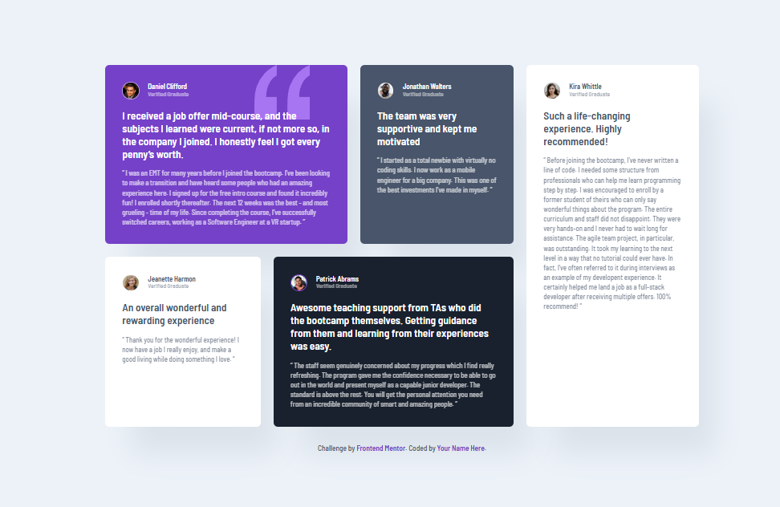

# Frontend Mentor - Testimonials grid section solution

This is a solution to the [Testimonials grid section challenge on Frontend Mentor](https://www.frontendmentor.io/challenges/testimonials-grid-section-Nnw6J7Un7).

## Table of contents

- [Overview](#overview)
  - [The challenge](#the-challenge)
  - [Screenshot](#screenshot)
  - [Links](#links)
- [My process](#my-process)
  - [Built with](#built-with)
  - [What I learned](#what-i-learned)
- [Author](#author)

## Overview

### The challenge

Users should be able to:

- View the optimal layout for the site depending on their device's screen size.
- Experience a professional UI with hover states and accessible design tokens.

### Screenshot



### Links

- Solution URL: [https://github.com/BaskoroR725/07-Testimonials-grid-section.git]
- Live Site URL: [https://baskoror725.github.io/07-Testimonials-grid-section/]

## My process

### Built with

- **Semantic HTML5 markup** – Using `article`, `blockquote`, and `header` for improved SEO and accessibility.
- **Sass (SCSS)** – Organized using a modular architecture for better maintainability.
- **BEM Methodology** – Block Element Modifier naming convention to manage CSS specificity.
- **CSS Grid** – Specifically using `grid-template-areas` for complex desktop layouts.
- **Mobile-first workflow** – Ensuring a seamless experience starting from small screens.
- **Fluid Typography** – Utilizing the `clamp()` function for responsive font sizes.

### What I learned

During this project, I strengthened my understanding of "Industrial Grade" CSS. I learned how to manage complex layouts using CSS Grid Areas, which makes the code much more readable than traditional grid column/row numbers.

I'm particularly proud of this Grid implementation:

```css
@media (min-width: 64rem) {
  .testimonial-grid {
    grid-template-areas:
      "daniel daniel jonathan kira"
      "jeanette patrick patrick kira";
  }
}
```

Instead of applying transitions globally and forcing them to stop with `!important` for accessibility, I used the `no-preference` media query. This ensures that animations only run for users who haven't enabled "Reduce Motion" in their system settings, improving both performance and accessibility.

```css
@media (prefers-reduced-motion: no-preference) {
  .testimonial-card {
    transition: transform 0.3s ease, box-shadow 0.3s ease;
  }

  .testimonial-card:hover {
    transform: translateY(-5px);
  }
}
```

### Author

Baskoro Ramadhan
